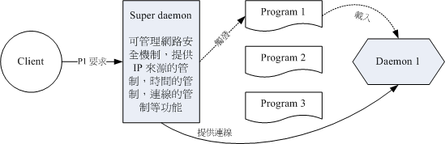

# daemon

如果依据 daemon 的启动与管理方式来区分，基本上，可以将 daemon 分为可独立启动的 stand alone ， 与透过一支 super daemon 来统一管理的服务这两大类。

## stand alone

就字面上的意思来说，stand alone 就是『独立的启动』的意思。这种类型的 daemon 可以自行启动而不必透过其他机制的管理； daemon 启动并加载到内存后就一直占用内存与系统资源。最大的优点就是：因为是一直存在内存内持续的提供服务， 因此对于发生客户端的要求时，stand alone 的 daemon 响应速度较快。常见的 stand alone daemon 有 WWW 的 daemon (httpd)、FTP 的 daemon (vsftpd) 等等。

## super daemon 

这一种服务的启动方式则是藉由一个统一的 daemon 来负责唤起服务！这个特殊的 daemon 就被称为 super daemon 。 早期的 super daemon 是 inetd 这一个，后来则被 xinetd 所取代了。这种机制比较有趣的地方在于， 当没有客户端的要求时，各项服务都是未启动的情况，等到有来自客户端的要求时， super daemon 才唤醒相对应的服务。当客户端的要求结束后，被唤醒的这个服务也会关闭并释放系统资源。

这种机制的好处是： (1)由于 super daemon 负责唤醒各项服务，因此 super daemon 可以具有安全控管的机制，就是类似网络防火墙的功能啦！ (2)由于服务在客户端的联机结束后就关闭，因此不会一直占用系统资源。但是缺点是什么呢？ 因为有客户端的联机才会唤醒该服务，而该服务加载到内存的时间需要考虑进去，因此服务的反应时间会比较慢一些啦！ 常见的 super daemon 所管理的服务例如 telnet 这个玩意儿就是啦！



图 1.1.1、Super daemon 的运行示意图

如上所示，Super daemon 是常驻在内存中的， Program 1, 2, 3 则是启动某些服务的程序 (未被启动状态)。当有客户端的要求时， Super daemon 才会去触发相关的程序加载成为 daemon 而存在于内存中，此时，客户端的要求才会被 Super daemon 导向 Daemon 1 去达成联机！当客户端的要求结束时，Daemon 1 将会被移除，图中实线的联机就会中断啰！

## daemon 工作形态的类型

如果以 daemon 提供服务的的工作状态来区分，又可以将 daemon 分为两大类，分别是：

- signal-control
  这种 daemon 是透过讯号来管理的，只要有任何客户端的需求进来，他就会立即启动去处理！例如打印机的服务 (cupsd)。

  

- interval-control
  这种 daemon 则主要是『每隔一段时间就主动的去运行某项工作』，所以，你要作的是在配置文件指定服务要进行的时间与工作， 该服务在指定的时间才会去完成工作。我们在[第十六章](http://cn.linux.vbird.org/linux_basic/0430cron.php)提到的 atd 与 crond 就属于这种类型的 daemon 啦 (每分钟侦测一次配置文件)

另外，如果你对于开发程序很有兴趣的话，那么可以自行查阅一下『 man 3 daemon 』看看系统对于 daemon 的详细说明吧！ ^_^。

## daemon的命名规则

每一个服务的开发者，当初在开发他们的服务时，都有特别的故事啦！不过，无论如何，这些服务的名称被创建之后，被挂上 Linux 使用时，通常在服务的名称之后会加上一个 d ，例如例行性命令的创建的 at, 与 cron 这两个服务， 他的程序文件名会被取为 atd 与 crond，这个 d 代表的就是 daemon 的意思。所以，在[第十七章](http://cn.linux.vbird.org/linux_basic/0440processcontrol.php)中，我们使用了 ps 与 top 来观察程序时，都会发现到很多的 {xxx}d 的程序，呵呵！通常那就是一些 daemon 的程序啰！

## **daemon 的启动脚本与启动方式**

提供某个服务的 daemon 虽然只是一支程序而已，但是这支 daemon 的启动还是需要运行档、配置文件、运行环境等等， 举例来说，你可以查阅一下 httpd 这个程序 (man httpd) ，里面可谈到不少的选项与参数呢！此外，为了管理上面的方便， 所以通常 distribution 都会记录每一支 daemon 启动后所取得程序的 PID 在 /var/run/ 这个目录下呢！ 还有还有，在启动这些服务之前，你可能也要自行处理一下 daemon 能够顺利运行的环境是否正确等等。鸟哥这里要讲的是， 要启动一支 daemon 考虑的事情很多，并非单纯运行一支程序就够了。

为了解决上面谈到的问题，因此通常 distribution 会给我们一个简单的 shell script 来进行启动的功能。 该 script 可以进行环境的侦测、配置文件的分析、PID 文件的放置，以及相关重要交换文件案的锁住 (lock) 动作， 你只要运行该 script ，上述的动作就一口气连续的进行，最终就能够顺利且简单的启动这个 daemon 啰！ 这也是为何我们会希望你可以详细的研究一下[第十三章](http://cn.linux.vbird.org/linux_basic/0340bashshell-scripts.php)的原因啊。

OK！那么这些 daemon 的启动脚本 (shell script) 放在哪里啊？还有， CentOS 5.x 通常将 daemon 相关的文件放在哪里？ 以及某些重要的配置文件又是放置到哪里？基本上是放在这些地方：

- **/etc/init.d/\* ：启动脚本放置处**
  系统上几乎所有的服务启动脚本都放置在这里！事实上这是公认的目录，我们的 CentOS 实际上放置在 /etc/rc.d/init.d/ 啦！ 不过还是有配置连结档到 /etc/init.d/ 的！既然这是公认的目录，因此建议您记忆这个目录即可！
- **/etc/sysconfig/\* ：各服务的初始化环境配置文件**
  几乎所有的服务都会将初始化的一些选项配置写入到这个目录下，举例来说，登录档的 syslog 这支 daemon 的初始化配置就写入在 /etc/sysconfig/syslog 这里呢！而网络的配置则写在 /etc/sysconfig/network 这个文件中。 所以，这个目录内的文件也是挺重要的；
- **/etc/xinetd.conf, /etc/xinetd.d/\* ：super daemon 配置文件**
  super daemon 的主要配置文件 (其实是默认值) 为 /etc/xinetd.conf ，不过我们上面就谈到了， super daemon 只是一个统一管理的机制，他所管理的其他 daemon 的配置则写在 /etc/xinetd.d/* 里头喔！
- **/etc/\* ：各服务各自的配置文件**
  [第六章](http://cn.linux.vbird.org/linux_basic/0210filepermission.php)就讲过了，大家的配置文件都是放置在 /etc/ 底下的喔！
- **/var/lib/\* ：各服务产生的数据库**
  一些会产生数据的服务都会将他的数据写入到 /var/lib/ 目录中。举例来说，数据库管理系统 MySQL 的数据库默认就是写入 /var/lib/mysql/ 这个目录下啦！
- **/var/run/\* ：各服务的程序之 PID 记录处**
  我们在[第十七章](http://cn.linux.vbird.org/linux_basic/0440processcontrol.php)谈到可以使用讯号 (signal) 来管理程序， 既然 daemon 是程序，所以当然也可以利用 kill 或 killall 来管理啦！不过为了担心管理时影响到其他的程序， 因此 daemon 通常会将自己的 PID 记录一份到 /var/run/ 当中！例如登录文件的 PID 就记录在 /var/run/syslogd.pid 这个文件中。如此一来， /etc/init.d/syslog 就能够简单的管理自己的程序啰。

了解配置文件之后，再看看daemon的启动方式

## Stand alone 的 /etc/init.d/* 启动

刚刚谈到了几乎系统上面所有服务的启动脚本都在 /etc/init.d/ 底下，这里面的脚本会去侦测环境、搜寻配置文件、 加载 distribution 提供的函数功能、判断环境是否可以运行此 daemon 等等，等到一切都侦测完毕且确定可以运行后， 再以 [shell script 的 case....esac](http://cn.linux.vbird.org/linux_basic/0340bashshell-scripts.php#case) 语法来启动、关闭、 观察此 daemon 喔！我们可以简单的以 /etc/init.d/syslog 这个登录档启动脚本来进行说明：

```
[root@www ~]# /etc/init.d/syslog
用法: /etc/init.d/syslog {start|stop|status|restart|condrestart}
# 什么参数都不加的时候，系统会告诉你可以用的参数有哪些，如上所示。

范例一：观察 syslog 这个 daemon 目前的状态
[root@www ~]# /etc/init.d/syslog status
syslogd (pid 4264) 正在运行...
klogd (pid 4267) 正在运行...
# 代表 syslog 管理两个 daemon ，这两个 daemon 正在运行中啦！

范例二：重新让 syslog 读取一次配置文件
[root@www ~]# /etc/init.d/syslog restart
正在关闭核心记录器:          [  确定  ]
正在关闭系统记录器:          [  确定  ]
正在启动系统记录器:          [  确定  ]
正在启动核心记录器:          [  确定  ]
[root@www ~]# /etc/init.d/syslog status
syslogd (pid 4793) 正在运行...
klogd (pid 4796) 正在运行...
# 因为重新启动过，所以 PID 与第一次观察的值就不一样了！这样了解乎？
```

由于系统的环境都已经帮你制作妥当，所以利用 /etc/init.d/* 来启动、关闭与观察，就非常的简单！话虽如此， CentOS 还是有提供另外一支可以启动 stand alone 服务的脚本喔，那就是 service 这个程序。 其实 service 仅是一支 script 啦，他可以分析你下达的 service 后面的参数，然后根据你的参数再到 /etc/init.d/ 去取得正确的服务来 start 或 stop 哩！他的语法是这样的啦：

```
[root@www ~]# service [service name] (start|stop|restart|...)
[root@www ~]# service --status-all
选项与参数：
service name：亦即是需要启动的服务名称，需与 /etc/init.d/ 对应；
start|...   ：亦即是该服务要进行的工作。
--status-all：将系统所有的 stand alone 的服务状态通通列出来

范例三：重新启动 crond 这支 daemon ：
[root@www ~]# service crond restart
[root@www ~]# /etc/init.d/crond restart
# 这两种方法随便你用哪一种来处理都可以！不过鸟哥比较喜欢使用 /etc/init.d/*

范例四：显示出目前系统上面所有服务的运行状态
[root@www ~]# service --status-all
acpid (pid 4536) 正在运行...
anacron 已停止
atd (pid 4694) 正在运行...
....(底下省略)....
```

这样就将一堆服务的运行状态栏出，你也可以根据这个输出的结果来查询你的某些服务是否正确运行了啊！^_^！ 其实，在上面的范例当中，启动方式以 service 这个程序，或者直接去到 /etc/init.d/ 底下启动，都一样啦！自行去解析 /sbin/service 就知道为啥了！ \^_^

## super daemon的启动方式

其实 Super daemon 本身也是一支 stand alone 的服务，看[图 1.1.1](http://cn.linux.vbird.org/linux_basic/0560daemons_1.php#fig_111) 就知道啦！因为 super daemon 要管理后续的其他服务嘛，他当然自己要常驻在内存中啦！所以 Super daemon 自己启动的方式与 stand alone 是相同的！ 但是他所管理的其他 daemon 就不是这样做啰！必须要在配置文件中配置为启动该 daemon 才行。配置文件就是 /etc/xinetd.d/* 的所有文件。那如何得知 super daemon 所管理的服务是否有启动呢？你可以这样做：

```
[root@www ~]# grep -i 'disable' /etc/xinetd.d/*
....(前面省略)....
/etc/xinetd.d/rsync:          disable = yes
/etc/xinetd.d/tcpmux-server:  disable = yes
/etc/xinetd.d/time-dgram:     disable = yes
/etc/xinetd.d/time-stream:    disable = yes
```

因为 disable 是『取消』的意思，因此如果『 disable = yes 』则代表取消此项服务的启动，如果是『 disable = no 』 才是有启动该服务啦！假设我想要启动如上的 rsync 这个服务，那么你可以这样做：

```
# 1. 先修改配置文件成为启动的模样：
[root@www ~]# vim /etc/xinetd.d/rsync
# 请将 disable 那一行改成如下的模样 (原本是 yes 改成 no 就对了)
service rsync
{
        disable = no
....(后面省略)....

# 2. 重新启动 xinetd 这个服务
[root@www ~]# /etc/init.d/xinetd restart
正在停止 xinetd:             [  确定  ]
正在激活 xinetd:             [  确定  ]

# 3. 观察启动的端口
[root@www ~]# grep 'rsync' /etc/services  <==先看看端口是哪一号
rsync           873/tcp               # rsync
rsync           873/udp               # rsync
[root@www ~]# netstat -tnlp | grep 873
tcp    0 0 0.0.0.0:873      0.0.0.0:*     LISTEN      4925/xinetd
# 注意看！启动的服务并非 rsync 喔！而是 xinetd ，因为他要控管 rsync 嘛！
# 若有疑问，一定要去看看图 1.1.1 才行！
```

也就是说，你先修改 /etc/xinetd.d/ 底下的配置文件，然后再重新启动 xinetd 就对了！而 xinetd 是一个 stand alone 启动的服务！这部份得要特别留意呢！

**Xinetd 服务的搭建与配置**：https://blog.51cto.com/13525470/2060765